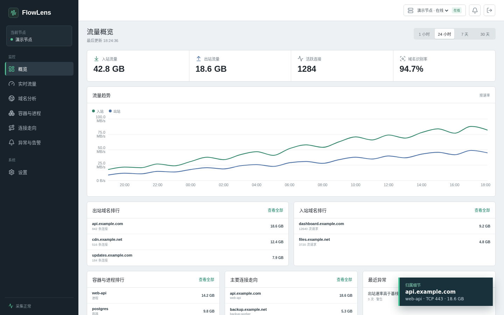

# FlowLens

FlowLens is a self-hosted Linux traffic observability service. A native Agent collects network-flow metadata and sends it to a native server, which stores it in PostgreSQL and serves a browser dashboard.

## What It Does

- Attributes traffic to host processes, Docker containers when explicitly enabled, and Nginx Proxy Manager hosts when their access logs are mounted read-only.
- Uses eBPF socket events, interface counters, process ownership, and bounded DNS/TLS evidence without storing packet payloads.
- Presents overview, flow, owner, domain, alert, health, retention, and webhook workflows in the web interface.
- Spools Agent events locally during temporary server outages.

## Architecture and Deployment

FlowLens runs as two native systemd services: `flowlens-agent.service` on observed Linux hosts and `flowlens-server.service` beside the web bundle. The server uses an existing PostgreSQL database and is normally published through an operator-managed HTTPS reverse proxy. FlowLens does not provide a container deployment stack.

Start with the [native installation guide](docs/operations/install.md). The [operations overview](docs/operations/foundation.md) covers service ownership and routine checks, while the [attribution guide](docs/operations/attribution.md) explains collector setup and evidence levels.

## Security and Privacy Tradeoffs

The Agent needs access to Linux networking telemetry. Its packaged systemd service and sysctl configuration should be reviewed against the host's hardening policy. Optional Docker attribution is disabled by default. Docker socket access is effectively host-level privilege, even though FlowLens only uses it for inventory reads; leave it disabled when container ownership is not required.

FlowLens stores connection metadata and derived attribution, which can still reveal infrastructure relationships. Restrict dashboard, database, configuration, backup, Agent spool, NPM log, and GeoIP file access. Use HTTPS, dedicated credentials, and retention settings appropriate for the environment. See [SECURITY.md](SECURITY.md) for private vulnerability reporting.

## Limitations

- Linux, systemd, eBPF support, and PostgreSQL are required for the intended deployment.
- Domain attribution can be inferred or unavailable because DNS caching, encrypted name resolution, shared hosting, and connection reuse limit the available evidence.
- Process and container ownership is time-sensitive; short-lived workloads may disappear before every collector observes them.
- FlowLens is an observability aid, not a packet capture system, billing meter, intrusion-prevention system, or replacement for host and database monitoring.
- Release acceptance measurements are environment-specific. The repository contains a measurement-free acceptance template rather than claimed benchmark results.

## Screenshots

Concept view rendered from the real dashboard with synthetic data. It contains no production hostnames, addresses, accounts, or traffic records. Public screenshots must use synthetic data and generic reserved example names and addresses. Do not publish screenshots containing real infrastructure, account names, hostnames, addresses, tokens, cookies, or traffic relationships.

## Development and License

See [CONTRIBUTING.md](CONTRIBUTING.md) for reproducible local checks. FlowLens is licensed under [Apache-2.0](LICENSE); attribution information is in [NOTICE](NOTICE).
